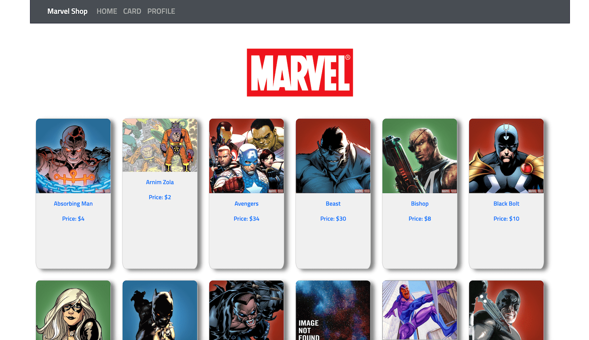

# Marvel Shop
Project link: [Marvel Shop](https://marvel-shop-6676f.web.app/)

## Technologies
- Javascript/HTML/CSS
- React JS
- FireBase - Authentication Database Hosting
- Marvel API https://www.artists.bandsintown.com/support/api-installation
- Marvel Package for API authentication
- Bootstrap

## Summary
Welcome to Marvel Shop. The idea of the project was to use the data from the Marvel API and make a Marvel store responsive web site to sell Marvel heroes. By using this project by changing the API we can have another shop for different products.
I used React JS to create the frontend and Firebase for the backend part. In the database, you can store your shopping list on your card and buy or remove them from your list.
The app is handeling sign in, sign up and quantity inputs so I can say there is less or no chance for any input errors. ALso, you can visit the site and see the product as a guest, but you are not able to buy see my card page.

I faced some challenges during the project which I can say Reac hook and also Marvel API, which is using a timestamp, API key, and hash(a combination of the private key, private key and timestamp), then I used Marvel package to make it.

## To do:
- Fixing some small bugs
- Adding footer
- Adding total priice

